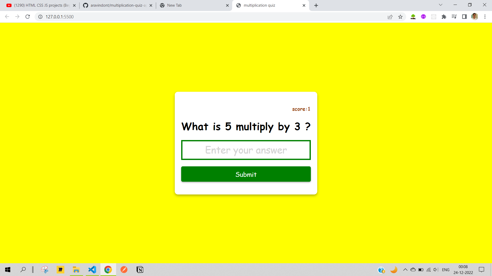

# Multipication Quiz

## HTML

- created a `index.html` file to write the markup for our app in the app i used `form` tag to stucture the application

## CSS

- created the `styles.css` file to add the styles to the markup written `HTML`

- Here I am using pure `vanila css` to add the styles.

- Always first step is to the `link` tag inside the `html` file to link both files.

- Added the style to html by trageting the `class` names and `id` names in the `styles.css` file and also adde the hoer effects using sudo classes.

## JavaScript

- created `index.js` file to add the javascript code to make the website functional

- In this project majorly learnt about how to add the `localStorage` to store the values of the variables for example in this app i store the score value and persisted its value even after reloading the website.

Sample snippet:

[Live-Link](https://aravindont.github.io/multiplication-quiz-app/?) of App
